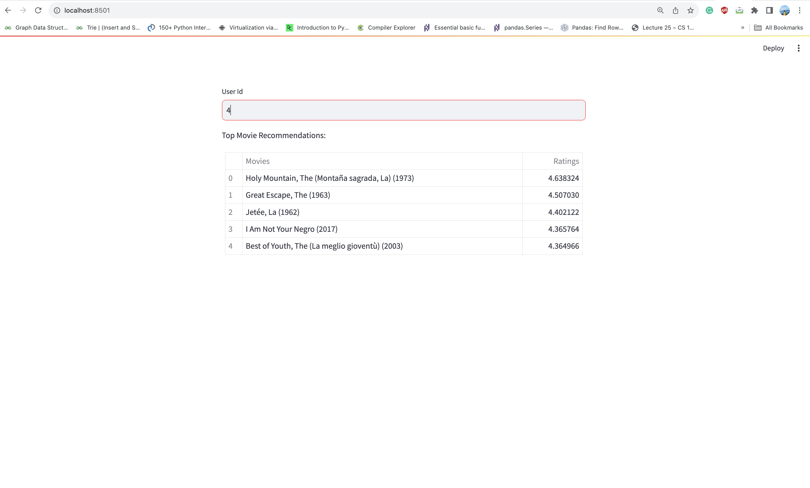

# movie-recommender-system

## Deployable model as a service

* Build Docker Image

`docker build --tag recommender-system .`

* Run the application

`docker run -p 8501:8501 recommender-system:latest`

* Go to http://localhost:8501

* Enter User Id for any user to see recommendation

    []

## Additional attachment

* Data analysis report (ipynb file is uploaded)
* Business evaluation report
* Community recommendation engine experiment report
